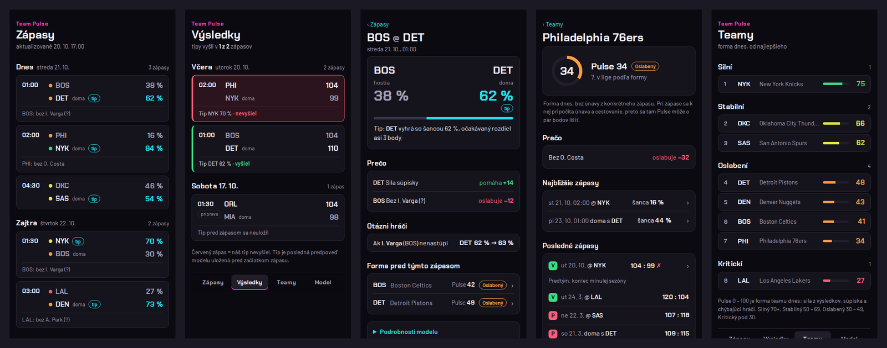
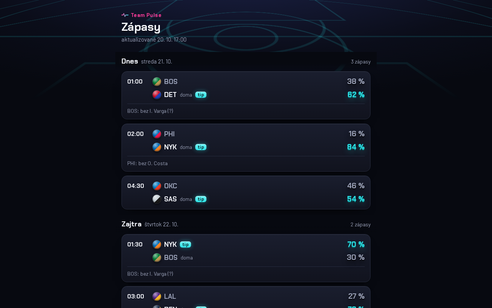
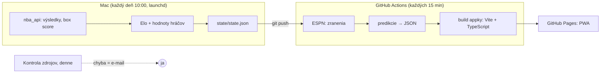

# Team Pulse

[](https://github.com/peterolah-qa/team-pulse/actions/workflows/ci.yml)
[](https://github.com/peterolah-qa/team-pulse/actions/workflows/app.yml)
[](https://github.com/peterolah-qa/team-pulse/actions/workflows/predict.yml)

**V akom stave je NBA team pred zápasom?** Team Pulse to vyhodnotí v 4 úrovniach
(Silný / Stabilný / Oslabený / Kritický), povie prečo, ako veľmi si je istý
a čo sa zmení, ak otázny hráč nenastúpi.

**→ [peterolah-qa.github.io/team-pulse](https://peterolah-qa.github.io/team-pulse/)** (appka sa dá nainštalovať na mobil)

> *In English:* a personal, non-commercial project. It is a web app (PWA) that rates each NBA team's
> condition before a game. It uses an Elo model replicated from FiveThirtyEight, plus learned layers for
> player availability, fatigue and roster strength. Everything runs on free data and free infrastructure.
> The project also serves as a QA-automation portfolio piece: see [Testing](#testovanie).



Team Pulse je len na orientáciu. **Neukazuje kurzy, nedáva tipy na stávky a neodkazuje na stávkové
kancelárie.** Nie je spojený s NBA ani s jej klubmi a nepoužíva ich logá.

---

## Čo appka ukazuje

| Obrazovka | Obsah |
|---|---|
| **Dnes** | zápasy na 3 najbližšie hracie dni: Pulse oboch teamov, úroveň, šanca na výhru, istota |
| **Zápas** | rozklad podľa vrstiev modelu (sila, súpiska, hráči, únava, prostredie) a top dôvody |
| **Team** | Pulse, trend za posledných 10 zápasov, súpiska so zraneniami a hodnotou hráčov |
| **Čo keby** | prepínač HRÁ / NEHRÁ pre otáznych hráčov, varovanie pri hraničnom prípade |
| **Model** | presnosť na neznámych zápasoch, kalibrácia, čo každá vrstva pridala, naučené váhy |

**Pulse** = 50 + (Elo dnes − 1505) / 6, teda 50 znamená priemerný team. Hranice úrovní sú 70 / 50 / 30.
Team, ktorý je dnes aspoň o 60 Elo pod svojím normálom (napr. mu chýba hviezda), padne o úroveň nižšie.



## Ako to funguje



- **Mac** robí ťažkú prácu, lebo stats.nba.com často blokuje požiadavky z cloudových serverov. Výsledkom je malý súbor stavu.
- **GitHub Actions** každých 15 minút stiahne zranenia, prepočíta predpovede a nasadí appku.
- **Archív predpovedí:** 2 hodiny pred zápasom cloud uloží predpoveď do `archive/predictions/`, kým zápas nezačne, prepisuje ju novšou; po začiatku sa už nemení. Mac ráno doplní výsledky (`archive/results/`) a prepíše [reports/live.md](reports/live.md) s presnosťou, log loss a kalibráciou ostrej prevádzky.
- **Príprava:** prípravné zápasy appka ukazuje so štítkom PRÍPRAVA. Do Ela, únavy v sezóne ani do vyhodnotenia sa nerátajú; v archíve slúžia ako skúška pred sezónou.
- **Náklady: 0 €.** Repo je verejné, Pages a Actions sú zadarmo a všetky zdroje dát sú voľné.

## Model

Základ je **Elo podľa FiveThirtyEight**. Je replikovaný a overený proti ich archívu: K = 20 · (MOV + 3)^0,8 / (7,5 + 0,006 · D),
výhoda domáceho prostredia a prenos medzi sezónami 0,75 · R + 0,25 · 1505. Nad ním sú naučené vrstvy:

- **B – hráči:** hodnota hráča z PIE a očakávané minúty. Chýbajúca kvalita sa násobí pravdepodobnosťou, že hráč nenastúpi.
- **C – únava a cestovanie:** odpočinok, back-to-back, 3 zápasy za 4 dni, kilometre, posun časových pásiem, nadmorská výška.
  Rátajú sa aj neutrálne ihriská (Mexico City, Paríž, Londýn, Berlín, Abú Zabí) a bublina 2020.
- **Sila súpisky:** top 11 hráčov podľa bežných minút.

Váhy sa učia logistickou regresiou na sezónach 2003/04 – 2022/23. Testujú sa na 2023/24 – 2025/26,
teda na zápasoch, ktoré model pri učení nevidel:

| Model | Presnosť | Log loss | Brier |
|---|---:|---:|---:|
| A: Elo (HCA 70) | 66,4 % | 0,6108 | 0,2116 |
| A + C (únava) | 66,8 % | 0,6081 | 0,2104 |
| A + B + C (chýbajúci hráči) | 67,3 % | 0,6039 | 0,2087 |
| **A + B + C + sila súpisky = v1** | **67,3 %** | **0,5996** | **0,2068** |

Vrstva sa do modelu dostala, len ak zlepšila log loss aspoň o 0,0005. Túto hranicu som stanovil vopred.
Pre porovnanie: aj stávkové kancelárie trafia víťaza len v 68 – 70 % zápasov. Podrobnosti sú v
[reports/backtest.md](reports/backtest.md), [reports/learned.md](reports/learned.md) a v bránach
[G0](docs/gate-G0.md), [G1](docs/gate-G1.md), [G3](docs/gate-G3.md).

## Testovanie

Projekt je zároveň ukážka QA automatizácie. Testuje sa model, dáta aj appka:

| Čo | Ako | Kde |
|---|---|---|
| Vzorce Elo | unit testy s ručne spočítanými príkladmi | `tests/test_elo.py` |
| Vlastnosti modelu | property-based testy (Hypothesis): Elo je hra s nulovým súčtom, pravdepodobnosti sú v 0 – 1 a dávajú spolu 1 | `tests/test_elo_properties.py` |
| Replikácia | porovnanie s archívom FiveThirtyEight od sezóny 2000/01 | `tests/test_replication_538.py` |
| Únik dát z budúcnosti | žiadny vstup nesmie byť novší ako začiatok zápasu | `tests/test_no_leakage.py` |
| Živé zdroje | kontraktové testy ESPN a NBA na uložených odpovediach, test, že sa nikdy nepoužijú kurzy | `tests/test_live_contracts.py` |
| Prevádzka | denná kontrola zdrojov a čerstvosti stavu, pri chybe príde e-mail | `.github/workflows/health.yml` |
| Appka E2E | Playwright na mobile (Pixel 7) aj desktope: navigácia, Čo keby, prázdne a chybové stavy, vodorovné posúvanie na 360 px | `app/tests/e2e.spec.ts` |
| Prístupnosť | axe-core, WCAG 2.1 A + AA, na každej obrazovke 0 porušení; ovládanie klávesnicou | `app/tests/a11y.spec.ts` |
| Vizuálna regresia | screenshoty 6 obrazoviek × 2 zariadenia | `app/tests/visual.spec.ts` |

Lighthouse (mobil): **Performance 100 · Accessibility 100 · Best Practices 100 · SEO 100.**

CI beží pri každom pushi: ruff (lint + formát), pytest, typová kontrola, build a Playwright.
Pred každým commitom sa spustí pre-commit (ruff, kontrola privátnych kľúčov a veľkých súborov).
Na GitHube je zapnutý secret scanning s push protection.

## Spustenie lokálne

```bash
# Python časť (Python 3.12, uv)
uv sync
uv run pytest
uv run python -m team_pulse.state        # stav zo stiahnutých dát
uv run python -m team_pulse.predict      # JSON pre appku → app/public/data

# appka (Node 22)
cd app
npm install
npx playwright install chromium          # len prvýkrát, pre testy
npm run dev                              # http://localhost:5173
npm test                                 # E2E + prístupnosť
npm run test:visual                      # vizuálna regresia (screenshoty sú z Linuxu/CI)
```

Denná úloha na Macu: `bash scripts/install_daily.sh` (launchd, 10:00).

## Štruktúra

```
src/team_pulse/     model (elo, players, schedule, learned), stav, predikcie, denná úloha
src/team_pulse/live ESPN zranenia a výsledky, NBA rozpis, párovanie mien
tests/              pytest + Hypothesis + fixtures živých zdrojov
app/                PWA: Vite + TypeScript bez frameworku, Playwright testy
models/v1.json      naučený model (váhy, kalibrácia, metriky)
state/state.json    denný stav z Macu
archive/            posledné predpovede pred zápasmi (cloud) a ich výsledky (Mac)
reports/, docs/     backtest, naučené váhy, vyhodnotenia brán
```

## Dáta

Voľné zdroje: [nba_api](https://github.com/swar/nba_api) (stats.nba.com), verejné endpointy ESPN (zranenia, výsledky)
a archív Elo FiveThirtyEight ([Neil Paine](https://github.com/Neil-Paine-1/NBA-elo)).
Stiahnuté dáta sa necommitujú. Mená hráčov v testoch a na screenshotoch sú vymyslené.

## Obmedzenia

- Backtest pozná absencie len z box score (kto nehral), nie zo skutočného injury reportu pred zápasom.
- Kalibrácia je najslabšia v pásme 60 – 70 %.
- Na začiatku sezóny 2026/27 je model o 2 – 3 body istejší ako trh. Sleduje sa to počas brány G2 (14 dní prevádzky).

## Plán

- [x] 0a – replikácia Elo (G0) · [x] 0b – vrstvy B, C, sila súpisky (G1) · [x] 1 – dátový agent a stav
- [x] 2 – PWA appka (G3)
- [ ] G2 – 14 dní ostrej prevádzky od 20. 10. 2026
- [ ] neskôr: Supabase (história predpovedí), notifikácie

---

Osobný nekomerčný projekt · [Qavant](https://github.com/peterolah-qa)
